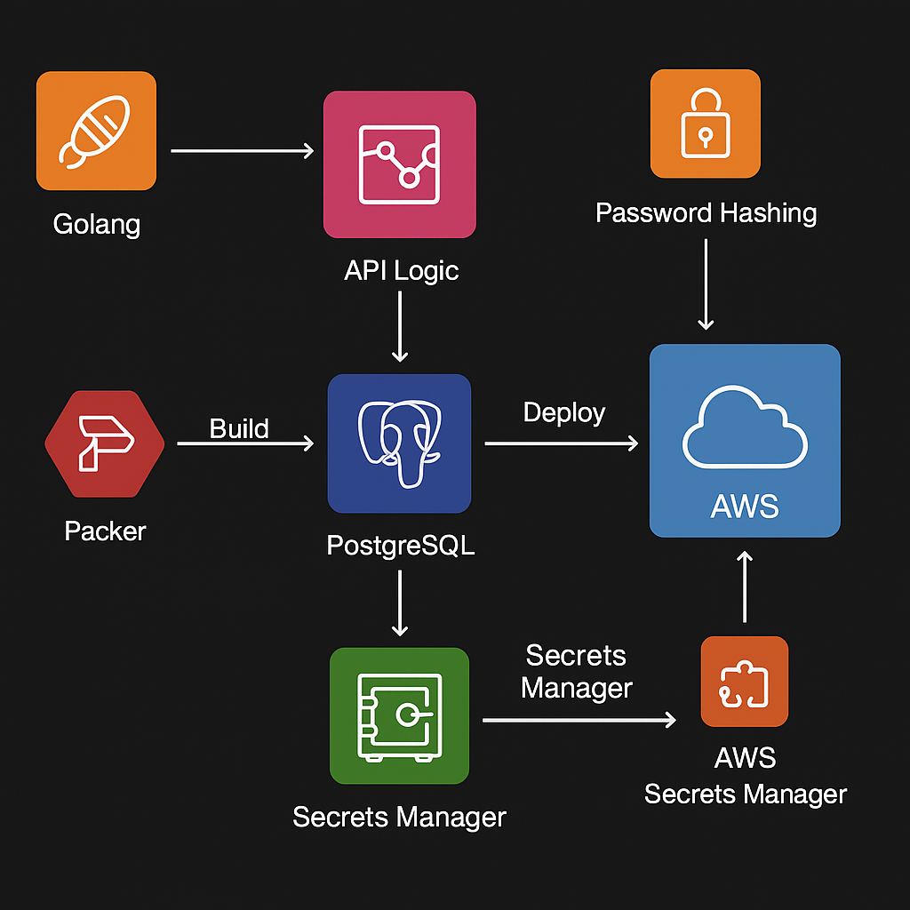

# User Management API with CI/CD and Packer

This project implements a User Management REST API using **Golang** for the backend and **PostgreSQL** for database management. The application supports basic authentication and features a fully automated CI/CD pipeline for creating and deploying custom AMIs using **Packer**. The infrastructure is set up to support scalability, high availability, and security.

## Architecture Overview

- **Backend**: Built using **Golang**, providing an efficient and scalable REST API.
- **Database**: **PostgreSQL** is used for data storage, managed securely and optimized for performance.
- **CI/CD Pipeline**: Automated using **Packer** for creating AMIs and **Terraform** for infrastructure provisioning.
- **Security**: Passwords are hashed using industry-standard techniques, and sensitive data is managed using **AWS Secrets Manager**.

## Features

- **User Management API**: 
  - Handles user registration, authentication, and profile management.
  - Provides RESTful endpoints for user operations.

- **CI/CD Automation**:
  - **Packer** is used for creating custom AMIs to streamline deployment.
  - CI/CD pipeline is set up to automatically build and deploy the latest version of the API and associated infrastructure.

- **Database**: 
  - **PostgreSQL** for reliable, secure, and scalable data management.
  
- **Security**:
  - Password hashing using industry-standard techniques (e.g., bcrypt).
  - Secrets and sensitive data management through **AWS Secrets Manager**.

## Architecture Diagram



## Prerequisites

- **Golang** installed
- **PostgreSQL** configured and running
- **Packer** installed for AMI creation
- **Terraform** installed for infrastructure provisioning
- **AWS CLI** configured with the appropriate IAM credentials
- **Docker** for local development and testing

## Setup

1. Clone this repository to your local machine:
   ```bash
   git clone <git@github.com:dumbresi/UserManagemenentSystem.git>
